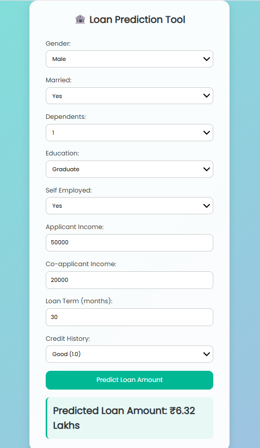

#  Loan Amount Predictor

A machine learning web application that predicts the **loan amount** a user might receive based on their personal and financial details. The model is trained using **Linear Regression** on a dataset sourced from **Kaggle**.


##  Project Overview

This project uses **Python**, **Flask**, and **HTML/CSS** to create an interactive web application that helps banks or financial institutions estimate potential loan amounts for applicants.


##  Features

- User-friendly web interface built with **HTML and CSS**
- Real-time loan amount prediction using a **trained Linear Regression model**
- Input fields include:
  - Gender
  - Marital Status
  - Number of Dependents
  - Education
  - Self Employment Status
  - Applicant Income
  - Co-applicant Income
  - Loan Term (in months)
  - Credit History


##  Dataset

- Source: [Kaggle - Loan Prediction Dataset](https://www.kaggle.com/)
- Used for training a **Linear Regression** model
- Preprocessing steps included:
  - Handling missing values
  - Encoding categorical variables
  - Normalizing numerical features


##  Tech Stack

| Technology | Purpose |
|------------|---------|
| Python     | Core programming |
| Flask      | Web framework |
| HTML/CSS   | Frontend interface |
| Scikit-learn | ML model and preprocessing |
| Pandas/Numpy | Data handling |

---

##  How to Run the Project

### 1. Clone the Repository

```bash
git clone https://github.com/Monisha-pj/Loan-Amount-Prediction-Model.git
cd Loan-Amount-Prediction-Model
```

### 2. Create Virtual Environment (optional but recommended)

```bash
python -m venv venv
```

### 3. Install Dependencies

```bash
pip install -r requirements.txt
```

### 4. Run the App

```bash
python app.py
```
Now open your browser and visit:
```bash
http://127.0.0.1:5000
```
You should see the Loan Amount Prediction Tool web interface.

## Screenshots


